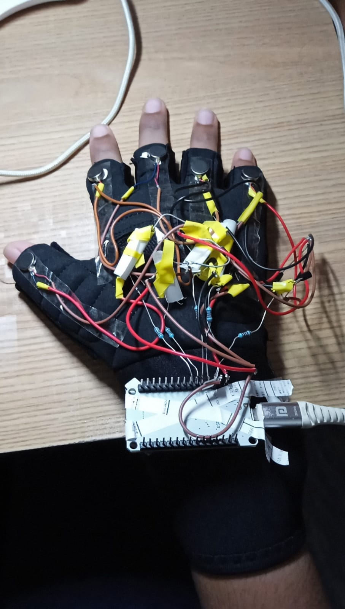
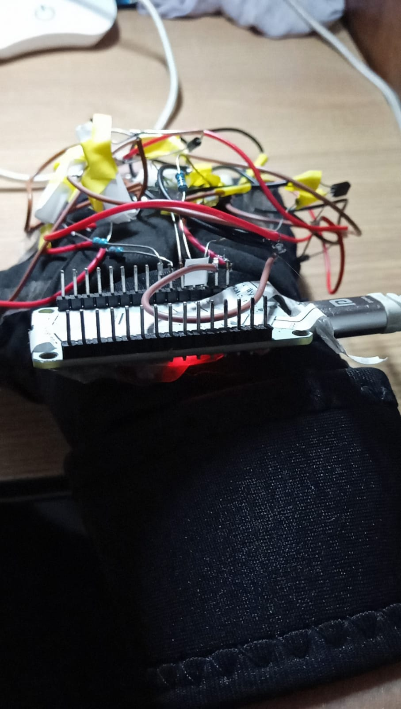
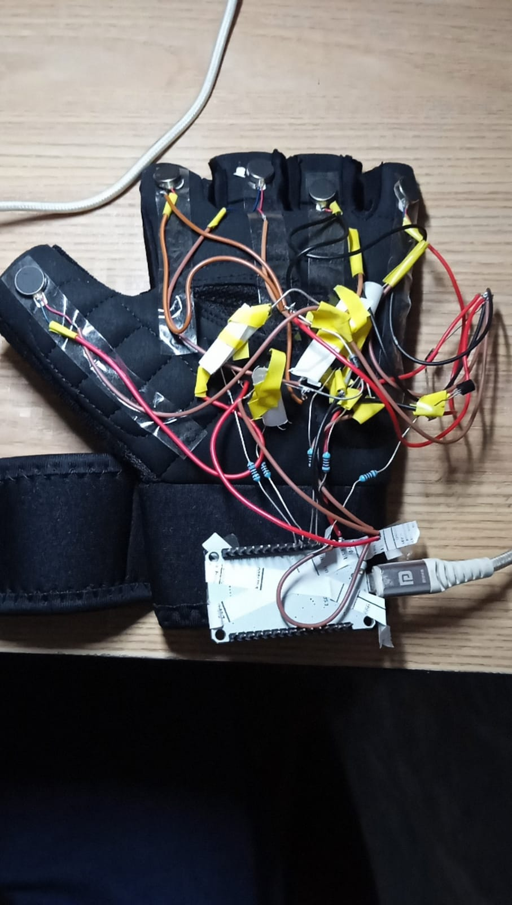

# Two-Way Sign Language Communication System Using Haptic Feedback

An assistive technology solution designed to bridge the daily communication gap between speech/hearing-impaired individuals and non-signers. This interdisciplinary prototype uses edge-based computer vision for gesture translation and an automated haptic glove system to guide non-signers on how to physically sign back.

## 💡 Key Innovation
Unlike traditional assistive solutions where the disabled individual must wear restrictive sensors, this system leaves the disabled user **completely hardware-free**. 
1. **Disabled User Channel:** Communicates naturally through sign language captured by a standard webcam.
2. **Abled User Channel:** Wears an active training glove that converts text replies into physical finger-vibration patterns to guide their physical sign replies.

## 📸 Hardware Prototype Gallery

<table>
  <tr>
    <td><b>Top View: Wiring Setup</b></td>
    <td><b>Side View: ESP32 Core</b></td>
    <td><b>Alternative View: Circuit Layout</b></td>
  </tr>
  <tr>
    <td></td>
    <td></td>
    <td></td>
  </tr>
</table>

---

## 🛠️ System Architecture & Specifications

### 💻 Software Layer
* **Language & Frameworks:** Python 3.12, OpenCV (Video stream handling)
* **AI Core:** `MediaPipe Hand Landmarker` (Real-time edge classification utilizing 21 3D hand joints)
* **Optimization Feature:** Multi-threaded execution pipelines (`threading`) ensuring asynchronous webcam monitoring while accepting text responses simultaneously without system latency.

### 🔌 Hardware Layer
* **Microcontroller Unit (MCU):** ESP32 Development Board (programmed via Arduino C/C++)
* **Actuators:** 5x Coreless Haptic Coin Vibration Motors mounted at fingertips
* **Data Transmission:** High-speed USB-to-UART Serial Bridge Interface (COM3/COM4 @ 115200 baud)
* **Electrical Safety Core:** Array of 10K Ohm pull-down resistors to control pin noise floating and isolate motor current surges from the main controller logic.

---

## 📊 Features & Gesture Vocabulary
The software architecture successfully detects **15 core vocabulary strings** and numbers natively:
* **Conversational Terms:** `HELLO`, `FINE`, `HELP`, `GOOD`, `NO`, `FIST`, `HOW ARE YOU`, `ROCK`, `SUPPORT`, `OK`, `I LOVE YOU`, `WAIT`, `AMAZING`
* **Numerical Digits:** Counting representations for `1`, `2`, `3`, `4`, `6`, `7`

### Automated Dynamic Hardware Defect Mitigation (Software Remapping)
The pipeline features an embedded algorithmic fault-tolerance layer. If the hardware data routes become mirrored or inverted during fast prototyping assembly, a runtime mapping layer translates the original logical binary arrays (e.g., `00111` for `OK`) into mapped positional parameters before dispatching across the physical serial stream.
